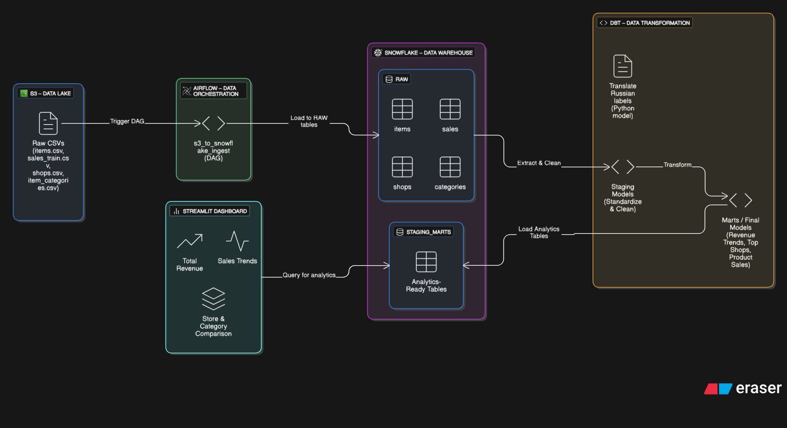

# Sales Performance Analytics Dashboard

A full-stack cloud analytics project that tracks sales performance across multiple stores and item categories using a real-world dataset. This project demonstrates cloud data engineering, data modeling, and advanced business intelligence capabilities.

---

## 🔗 Demo

**Video demo:**  


---

## 🚀 Overview

**Goal:** Build an end-to-end cloud analytics pipeline to analyze and visualize retail sales data using a modern data stack.

---


## 🧱 Architecture Overview
**Pipeline Stack:**
This is a high-level view of the cloud analytics pipeline:




---

## 📦 Dataset

* Source: Kaggle - "Predict Future Sales"
* Files:

  * `sales_train.csv`
  * `items.csv`
  * `item_categories.csv`
  * `shops.csv`
* Size: \~3 million rows

---

## 🔧 Pipeline Breakdown

### 1. **Raw Data Ingestion** (Airflow)

* Custom Airflow DAG downloads CSV files from a public S3 bucket
* Loads each dataset into Snowflake's `RAW` schema
* Uses PythonOperator with Snowflake connector

### 2. **Staging Models** (dbt)

* Standardize and clean raw data into the `STAGING` schema
* Convert dates and map Russian labels to English
* Validate data quality using dbt tests

### 3. **Mart Models** (dbt)

* Built into `STAGING_MARTS` schema
* Aggregated models:

  * Daily & monthly sales
  * Revenue by month / shop / category
  * Top products & categories
  * Shop-category matrix
  * Revenue variance metrics

### 4. **Dashboard App** (Streamlit)

* Fully interactive frontend connected to Snowflake in real time
* Cached queries for speed and efficiency
* Hosted on always-on AWS EC2 instance

---

## 📊 Dashboard Features

### 🔹 Top KPIs

* Total Revenue
* Total Items Sold
* Active Shops
* MoM Revenue Change %

### 🔹 Time Series

* Monthly Revenue Trend
* Monthly Quantity Sold

### 🔹 Breakdown Charts

* Revenue by Category (Bar)
* Top Shops by Revenue (Bar)
* Revenue by Shop-Category (Treemap)

### 🔹 Advanced Insights

* Price vs Quantity Correlation (Scatter)
* Monthly Item Consistency (Heatmap)
* Shop Radar Profiles (Radar chart)
* New vs Old Items Trend (Line)

### 🔹 Interactivity

* Month filter (single or range)
* Shop / Category filters
* Revenue vs Volume toggle

---

## 🛠 Deployment

* Hosted on **AWS EC2** (Ubuntu)
* Systemd used to auto-restart on reboot/failure
* UFW configured to expose on custom port
* Virtualenv used for Streamlit dependencies

---

## 💡 Business Value

This project simulates what a client-facing retail analytics solution would look like. It helps answer:

* Which shops are top performers or underperforming?
* How stable is each shop's revenue stream?
* Which categories drive the most revenue or volume?
* Are new items gaining traction compared to legacy products?

---

## 📁 Folder Structure

```
project/
├── airflow/                  # DAG to ingest S3 -> Snowflake
├── dbt_sales_pipeline/       # dbt project (models, staging, marts)
├── streamlit_dashboard/       # Streamlit app files
└── README.md
```

---

## 🧠 Technical Flow

The diagram below shows all tools, data flow, environments, and layers in detail:


* Data Engineering: Airflow, Snowflake, S3
* Data Modeling: dbt, SQL testing, normalization
* Dashboarding: Streamlit, Plotly, Altair
* Deployment: EC2, Linux, ports, virtualenv, systemd
* Business Insight: KPI design, chart selection, storytelling

---

## 🌐 Live Links

- 📊 [Interactive Streamlit Dashboard](http://16.171.242.247/)
- 📘 [dbt Documentation](https://taleltaieb.github.io/sales_pipeline_cloud_final/#!/overview)
- 📂 [GitHub Repository](https://github.com/taleltaieb/sales_pipeline_cloud_final)

---

## 🙋‍♂️ Author

**Talel Taieb**

* [LinkedIn](https://www.linkedin.com/in/talel-taieb/)
* [Portfolio](https://taleltaieb.github.io/)
